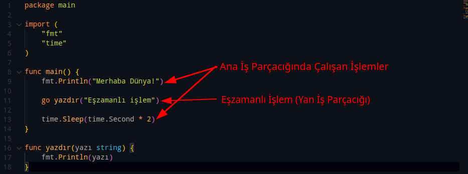

# Goroutine

**Goroutine**’ler **Go Runtime** tarafından yönetilen hafif bir sistemdir. Bir işlemi eşzamanlı olarak yapmak istiyorsak, Goroutine'den faydalanabiliriz. Bu sayede aynı çalışma-zamanı içerisinde birden fazla iş parçacığı oluşturabiliriz.

## Terimler

### Ana iş parçacığı

`Main()` fonksiyonu içerisine yazdığımız, asenkron olmayan kodlardır. Varsayılan olarak Go Runtime bu iş parçacığını izler. Programımız asenkron işlemlerin tamamlanmasını beklemiyorsa, ana iş parçacığı tamamlandığında program sona erer.

### Eşzamanlılık

Eşzamanlılık, programlamada bir işlem gerçekleşirken, aynı zamanda başka işlemlerin de gerçekleşmesidir.

## Eşzamanlı Bir İşlem Oluşturalım

Eşzamanlı bir işlem oluşturmak için `go` anahtar kelimesinden faydalanabiliriz. Bunun için eşzamanlı çalışacak işlemin başına `go` yazmamız yeterli olacaktır.

Aslında yukarıdaki örnekte `time.Sleep()` kullanarak 2 saniye bekletmemizin bir sebebi. Eğer `time.Sleep()` eklememiş olsaydık, ekrana _"Merhaba Dünya!"_ yazıldıktan sonra programımız sonlanacaktı. Bunun sebebi Go Runtime'ının Sadece Ana iş parçacığını beklemesi. Ana iş parçacığındaki işlemler sonlandıktan sonra, diğer işlemleri beklemiyor. Yukarıdaki örnekte bunu engellemek için `time.Sleep()` kullandık. Böylece program 2 saniye beklerken eşzamanlı işlemimiz de tamamlandı. Tabii `time.Sleep()` kullanarak beklemek mantıklı bir yöntem değil. İşlemin ne kadar süreceğini bilmediğimiz durumlar olacaktır. Bunun için Kanalları kullanabiliriz.

