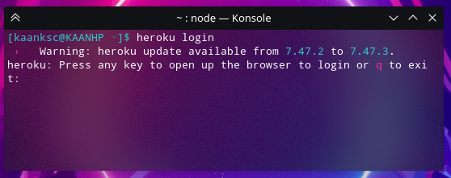

# Heroku'da Go Uygulaması Yayınlama

## Öncelikle Bilmeyenler İçin Heroku Nedir?

Kısaca Heroku, JavaScript, Go, Ruby, Python, Scala, PHP, Java, Clojure ile geliştirdiğimiz sunucu uygulamalarını ücretsiz barındırabileceğimiz bir platformdur.

Aşağıdaki bağlantıdaki blog yazısını okumanızı tavsiye ederim.



## Projemizi Planlayalım

Bu örneğimizde bir web sunucu oluşturacağız. Öncelikle `Go modules` kullanacağımız için projemizi kullanıcının go dizinine oluştumalıyız.

Komut satırını açalım ve aşağıdaki komutu yazarak bahsettiğimiz dizine geçelim.

Windows'ta:

> cd C:\\Users\%username%\go\src

GNU/Linux ve MacOS'te:

> cd ~/go/src

Bu konuma proje dizinimizi oluşturalım

> mkdir heroku-app

`heroku-app` klasörü projemizin ana dizini olacak. Aşağıdaki komut ile proje ana dizinimize girelim.

> cd heroku-app

Daha sonra bu dizini `code .` komutu ile VSCode üzerinde açalım.

`main.go` dosyamızı oluşturalım ve aşağıdaki gibi olsun.

```go
package main

import (
	"fmt"
	"net/http"
	"os"
)

func main() {
	port := os.Getenv("PORT")
	http.HandleFunc("/", anaSayfa)
	http.ListenAndServe(":"+port, nil)
}

func anaSayfa(w http.ResponseWriter, r *http.Request) {
	port := os.Getenv("PORT")
	fmt.Fprintf(w, "Merhaba Dünya!\nKullanılan Port: "+port)
}
```

Yukarıda normal web sunucu oluşturma kodlarından biraz farklı işlemler var. Bunları açıklamak gerekir ise:

`port` değişkenimiz sistemden `string` tipinde `PORT` ortam değişkenini alıyor. Yani `port` değişkeni sunucumuzun hangi portta çalışacağını belirliyor. Uygulamamızı Heroku'ya yükledikten sonra sistemimiz Heroku olduğu için port ortam değişkenini Heroku'dan almış olacağız. Sunucunun çalışacağı portu Heroku belirlediği için portu kendimiz kodlar içinde belirleyemiyoruz.

`http.ListenAndServe()` fonksiyonuna da parametre olarak `":"+port` vererek devam ediyoruz.

Sunucumuzun ana dizinini yakalacak olan anaSayfa fonksiyonumuza bakalım.

Yine burada sistemden portu istedik. Hemen aşağısında "Merhaba Dünya!" ve kullanılan portun çıktısını vermesini sağladık. Kodlarımız artık hazır.

Bu projemizde dışarıdan bir pakete ihtiyacımız olmadı. Hepsi Go'nun hazır paketlerinden. Eğer dışarıdan paketler olsa ne yapacaktık? Hadi hemen görelim.

Komut satırına go modules için aşağıdaki komutu yazalım.

> go mod init


Eğer projenizi go/src klasörü içinde oluşturmazsanız bu komut hata verecektir.



Böylece go.mod dosyamızı oluşturduk. Dışarıdan paket bağımlılıklarını yüklemek için aşağıdaki komutu yazalım.

> go mod vendor

Bu komutu yazdığınızda paket bağımlılığınız yoksa aşağıdaki gibi bir çıktı alacaksınız.


Eğer paket bağımlılığınız varsa projenizin ana dizininde cendor adında bir klasör oluşacak ve bu klasörün için dış paketlerin kaynak kodları bulunanacak.

## Versiyon sistemli hale getirelim

Öncelikle git projemizi oluşturalım. Komut satırına:

> git init

Daha sonra oluşturduğumuz projeyi staging'e almak için:

> git add .

yazalım. Commit oluşturmak için ise:

> git commit -m "Heroku uygulamamı oluşturdum."

## Heroku'da Yayınlama

Öncelikle Heroku'nun komut satırı uygulamasını bilgisayarımıza kuralım.

Windows, MacOS ve Ubuntu için [bu adresten](https://devcenter.heroku.com/articles/heroku-cli#download-and-install) kurabilirsiniz.

Arch Linux ve türevleri için kolaylık açısından AUR üzerinden `heroku-cli-bin` aratarak kurabilirsiniz.

Uygulamayı kurduktan sonra Heroku Hesabımıza bağlayalım.

Komut satırına aşağıdakileri yazalım.

> heroku login

Şöyle bir çıktı verecek:



q tuşuna basınca giriş yapmayı iptal eder. O yüzden giriş yapmak için herhangi bir tuşa başabilirsiniz. \(Lütfen bilgisayarınızın güç tuşuna basmayın 🙂\)

Daha sonra varsayılan tarayıcınız üzerinden giriş yapma sayfası açılacak. Heroku hesabınıza girdikdek sonra tarayıcınızda girişin başarılı olduğunu söylecek.


Komut satırında da aşağıdaki gibi bir çıktı göreceksiniz. Kendi bilgilerim olduğu için birazını sansürledim.


Böylece başarıyla giriş yapmış olduk.

Heroku projemizi oluşturalım.

> heroku create

Şöyle bir çıktı alacağız.


Yazdığımız kodları Heroku uygulamamıza yükleyelim.

> git push heroku master

Bu komut sonrasında aşağıdakine benzer bir sonuç almanız gerekir.

```go
[kaanksc@KAANHP heroku-app]$ git push heroku master
Enumerating objects: 4, done.
Counting objects: 100% (4/4), done.
Delta compression using up to 4 threads
Compressing objects: 100% (3/3), done.
Writing objects: 100% (4/4), 477 bytes | 477.00 KiB/s, done.
Total 4 (delta 0), reused 0 (delta 0), pack-reused 0
remote: Compressing source files... done.
remote: Building source:
remote: 
remote: -----> Go app detected
remote: -----> Fetching jq... done
remote: -----> Fetching stdlib.sh.v8... done
remote: -----> 
remote:        Detected go modules via go.mod
remote: -----> 
remote:        Detected Module Name: heroku-app
remote: -----> 
remote:  !!    The go.mod file for this project does not specify a Go version
remote:  !!    
remote:  !!    Defaulting to go1.12.17
remote:  !!    
remote:  !!    For more details see: https://devcenter.heroku.com/articles/go-apps-with-modules#build-configuration
remote:  !!    
remote: -----> New Go Version, clearing old cache
remote: -----> Installing go1.12.17
remote: -----> Fetching go1.12.17.linux-amd64.tar.gz... done
remote: -----> Determining packages to install
remote:        
remote:        Detected the following main packages to install:
remote:                 heroku-app
remote:        
remote: -----> Running: go install -v -tags heroku heroku-app 
remote: heroku-app
remote:        
remote:        Installed the following binaries:
remote:                 ./bin/heroku-app
remote:        
remote:        Created a Procfile with the following entries:
remote:                 web: bin/heroku-app
remote:        
remote:        If these entries look incomplete or incorrect please create a Procfile with the required entries.
remote:        See https://devcenter.heroku.com/articles/procfile for more details about Procfiles
remote:        
remote: -----> Discovering process types
remote:        Procfile declares types -> web
remote: 
remote: -----> Compressing...
remote:        Done: 3.6M
remote: -----> Launching...
remote:        Released v3
remote:        https://obscure-ocean-33068.herokuapp.com/ deployed to Heroku
remote: 
remote: Verifying deploy... done.
To https://git.heroku.com/obscure-ocean-33068.git
 * [new branch]      master -> master
```

Yukarıdaki çıktıya göre aşağıdaki işaretlediğim yerde uygulamamızın adresi olacak.


Bu adres tabiki de sizde farlı olacak. Buradan girip uygulamanızı kontrol edebilirsiniz. Benim sonucum ise şu şekilde:


